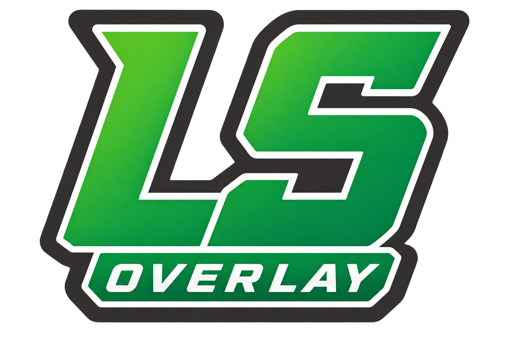

# LS Overlay



**LS Overlay 2.2.0**은 GTA Online을 플레이하면서 Discord 채팅과 판매 순서, 일일·주간 정보, 주요 사업장 타이머를 함께 확인할 수 있는 Windows HUD 도구입니다.

LS Overlay는 Rockstar Games, Take-Two Interactive, Discord와 제휴하거나 이들의 승인을 받은 제품이 아닌 독립적인 비공식 도구입니다.

## 2.2 주요 기능

- **Main HUD**: 선택한 Discord 채널의 최근 채팅, 언급, Reaction, 이미지, 스티커와 판매 대기열 표시
- **GTA 컴패니언**: 오늘의 도전, 주간 도전, 주간 보너스·할인·이벤트를 별도 HUD로 표시
- **사업장 관리자**: 벙커, 나이트클럽, LSD, 세차장, 스페셜 패키지, 항공 화물, 습격과 일반 타이머 관리
- **움직이는 미디어**: GIF, WebP, Discord 스티커와 움직이는 Custom Emoji의 지원 가능한 형식 재생
- **판매 히스토리**: 판매완료가 서버에서 확인된 내역과 최근 판매 시각 확인
- **직접 단축키 입력**: 설정 칸을 누르고 키 또는 조합을 바로 입력하며, 입력 중 ESC로 매핑 해제
- **독립 HUD 배치**: Main HUD, GTA 컴패니언, 사업장 관리자의 위치와 크기를 각각 보존

## 사용 환경

- Windows x64
- 인터넷 연결
- GTA V Enhanced / GTA Online
- LS Overlay를 지원하는 Discord 서버에 접근 가능한 Discord 계정

Discord Desktop 앱은 필수가 아닙니다. 독점 전체 화면에서 HUD가 가려지면 GTA를 테두리 없는 창 모드로 실행하세요.

## 다운로드

정식 배포 후 [GitHub Releases](https://github.com/Revo-32/Gacha-Overlay/releases)에서 **LS-Overlay-2.2.0-win-x64.zip**을 받으세요. GitHub가 자동 생성하는 **Source code** 파일은 실행용 패키지가 아닙니다.

ZIP을 원하는 새 폴더에 모두 압축 해제하고 **LSOverlay.exe**를 실행합니다. 별도 설치 프로그램이나 .NET 설치는 필요하지 않습니다. 자동 업데이트와 실행 파일 코드 서명은 제공하지 않으므로, Windows 경고가 나타나면 배포 페이지와 SHA-256을 먼저 확인하고 보안 기능을 끄지 마세요.

## 빠른 시작

1. ZIP을 새 폴더에 모두 압축 해제합니다.
2. 기존 버전을 실행 중이면 트레이 아이콘을 우클릭해 **종료**합니다.
3. **LSOverlay.exe**를 실행합니다.
4. **Discord로 로그인**을 누르고 브라우저에서 승인합니다.
5. 허용된 메인 채널을 선택하고 초기 안내를 마칩니다.
6. GTA Online을 실행하고 HUD를 확인합니다.

기존 버전 사용자는 `%LOCALAPPDATA%\GachaOverlay`를 삭제하지 마세요. 같은 Windows 계정에서는 호환되는 설정과 로그인 정보를 이어서 사용합니다.

- [LS Overlay 2.2 빠른 시작 원문](docs/2.2/quick-start/LS-Overlay-2.2-Quick-Start-ko.md)
- [LS Overlay 2.2 상세 사용자 설명서 원문](docs/2.2/user-guide/LS-Overlay-2.2-User-Guide-ko.md)
- [LS Overlay 2.2.0 릴리즈 노트](docs/releases/LS-Overlay-2.2.0-release-notes.md)

배포 ZIP에는 **LS-Overlay-2.2-Quick-Start-ko.pdf**와 **LS-Overlay-2.2-User-Guide-ko.pdf**가 함께 들어 있습니다. 정식 배포 후 릴리즈 첨부 파일에서도 각각 받을 수 있습니다.

## F9와 F10

| 기본 키 | 동작 |
|---|---|
| F9 | 모든 HUD를 함께 표시하거나 숨깁니다. 개별적으로 꺼 둔 보조 HUD를 강제로 켜지는 않습니다. |
| F10 | 모든 HUD의 잠금 상태를 전환합니다. |

잠금 상태에서는 마우스 입력이 게임으로 통과합니다. 위치 이동, 크기 조절, 스크롤 또는 버튼 사용이 필요하면 F10으로 잠금을 해제하세요.

## Discord 연결과 보안

Discord 인증은 시스템 브라우저의 공식 OAuth 화면에서 진행합니다. LS Overlay는 사용자의 Discord 토큰을 붙여 넣도록 요구하지 않습니다. 연결에 필요한 클라이언트 자격 정보는 현재 Windows 사용자를 기준으로 보호해 저장합니다.

- [서비스 상태](https://status.revo32.cloud)
- [개인정보처리방침](https://overlay.revo32.cloud/privacy)
- [이용약관](https://overlay.revo32.cloud/terms)
- [지원 문의](mailto:revo.32.39.41@gmail.com)

진단 파일은 사용자가 직접 만들며 자동 업로드되지 않습니다. 공유 전에 내용을 확인하고 공개 게시판에는 올리지 마세요.

## 2.0에서 업그레이드

- LocalAppData 위치는 계속 `%LOCALAPPDATA%\GachaOverlay`입니다.
- F9는 Main HUD뿐 아니라 활성화된 GTA 컴패니언과 사업장 관리자에도 공통 표시 상태를 적용합니다.
- 일반 12/24/48분 타이머는 사업장 관리자에서 관리합니다.
- 단축키는 키 입력으로 직접 지정하며, 캡처 중 ESC를 누르면 해당 매핑이 **미지정**이 됩니다.
- GTA 컴패니언과 사업장 관리자는 기본적으로 사용자가 켜기 전까지 비활성화되어 있습니다.

## 개발

개발 빌드는 Windows와 .NET 8 SDK가 필요합니다.

```powershell
dotnet build GachaOverlay.sln
dotnet test GachaOverlay.sln
```

일반 사용자는 소스 빌드, Bot Token, Discord Developer Portal 또는 서버 설정을 준비할 필요가 없습니다.

## 라이선스

프로젝트 소스는 [MIT](LICENSE) 라이선스입니다. 포함된 .NET 런타임, 글꼴, 색상 테마, SkiaSharp의 고지는 배포 ZIP의 `Licenses` 폴더에 함께 제공됩니다.
