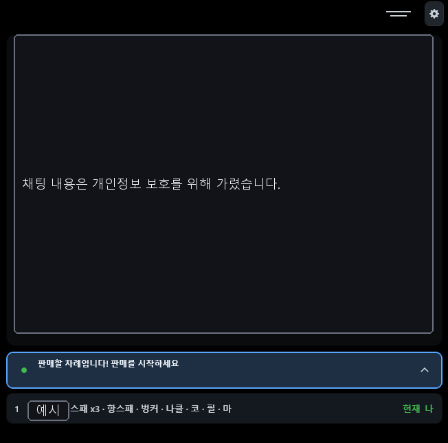
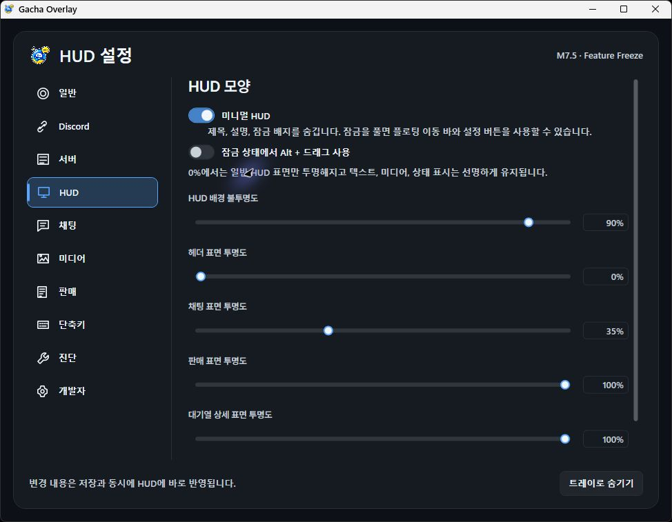
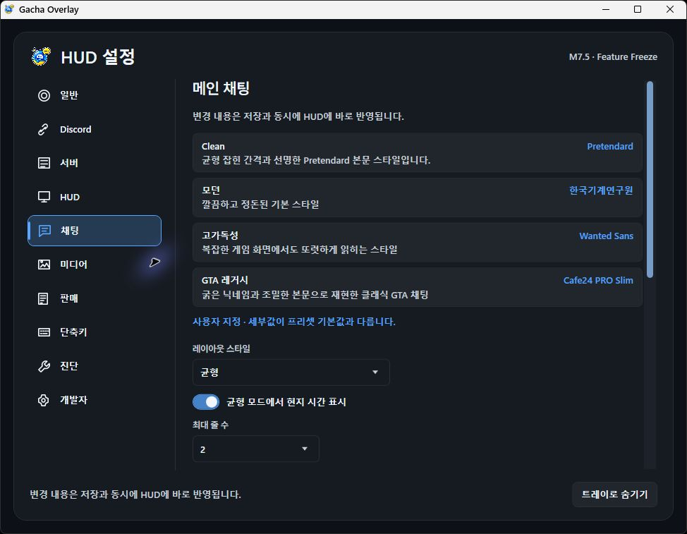
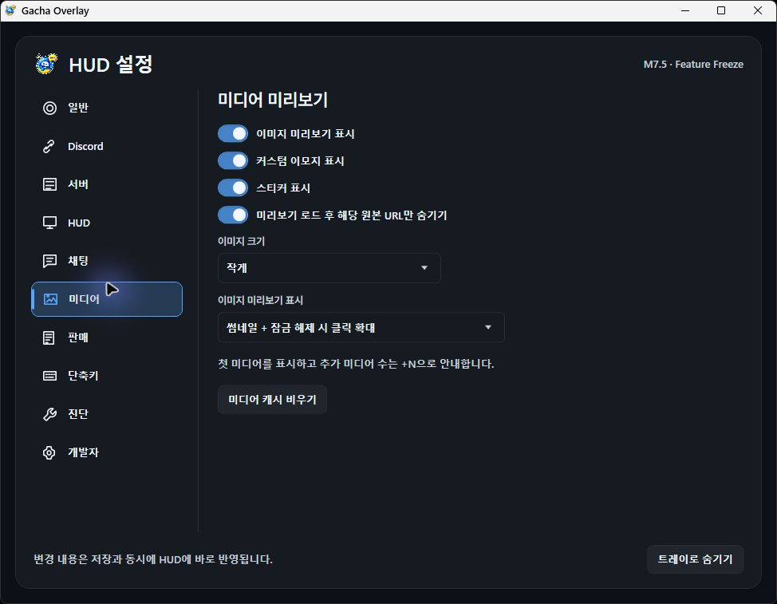
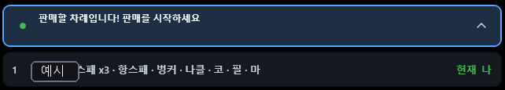
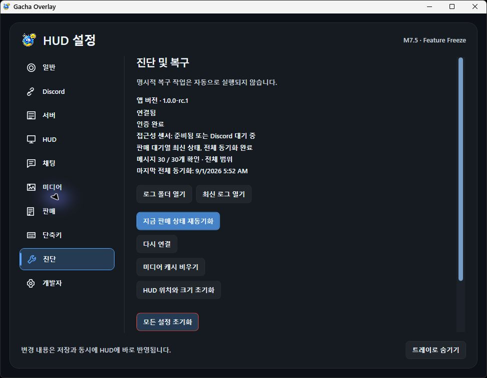

# Gacha Overlay

## 사용자 설명서

- Version: 1.0.0-rc.1 code line / M9.11 Remote-only architecture
- Document: Manual 1.2
- Updated: 2026-09-03

<!-- BODY -->

# 처음 사용하시는 분은 여기부터

## 이제 연결 방법은 하나뿐입니다

Gacha Overlay의 채팅, 판매, GTA 세션 인원, 판매 상태 변경은 모두 인증된 Remote Backend를 통해 전달됩니다. Discord Desktop의 로컬 연결이나 개인 Discord Application은 사용하지 않습니다.

준비물:

- Windows x64 PC
- 대상 Discord 서버에 참여한 Discord 계정
- 운영자에게 받은 Remote Backend 주소
- Discord 웹, 모바일 또는 데스크톱 중 하나
- Gacha Overlay Release ZIP

<!-- FLOW: ZIP 압축 해제 | Remote 주소 입력 | 설치본 페어링 | 메인 채널 선택 | HUD 사용 -->

> [!IMPORTANT]
> 일반 사용자는 Bot Token, Client Secret, Redirect URI를 입력하지 않습니다. Remote Backend 운영자가 Bot 연결을 관리합니다.

<!-- PAGE -->

# 이 설명서를 사용하는 방법

## 큰 흐름만 먼저 확인하세요

앱은 처음 실행할 때 언어, Remote 연결, HUD 안내의 3단계 초기 설정을 엽니다. Remote 연결 단계에서 주소를 적용하고 페어링 코드를 Discord 명령으로 승인한 뒤, 허용된 메인 채널 하나를 선택합니다.

<!-- TOC -->

## 정상 상태의 기준

- Remote 상태가 `Live`
- 최근 메인 채팅 20개가 표시됨
- Remote Sales가 `RemotePrimary / Complete`
- 선택한 Host 1 또는 Host 2의 GTA 세션 정보가 표시됨
- Discord Desktop이 꺼져 있어도 위 기능이 유지됨

<!-- PAGE -->

# PART 1 · 설치와 Remote 연결

## ZIP을 새 폴더에 완전히 압축 해제하세요

ZIP 안의 파일을 한 폴더에 모두 푼 뒤 `GachaOverlay.App.exe`를 실행합니다. 별도 .NET 설치가 필요 없는 Windows x64 단일 파일 배포본을 기준으로 합니다.

Windows 보호 경고가 나타나면 배포 출처와 파일을 먼저 확인하세요. 앱은 시스템 관리자 권한을 요구하지 않습니다.

> [!TIP]
> HUD가 보이지 않아도 앱이 종료된 것은 아닐 수 있습니다. Windows 오른쪽 아래 알림 영역의 Gacha Overlay 아이콘을 우클릭하면 설정, HUD 표시, 종료 메뉴를 열 수 있습니다.

## 업데이트할 때

앱을 완전히 종료한 뒤 새 ZIP을 별도 폴더에 풀어 실행하세요. 설정과 보호된 Remote 페어링 정보는 현재 Windows 사용자 데이터 폴더에 유지됩니다.

<!-- PAGE -->

# Remote 구조 이해하기

## Discord Desktop은 데이터 통로가 아닙니다

운영 Backend가 Discord Bot으로 필요한 데이터를 받고, 인증된 Remote Protocol을 통해 WPF HUD에 전달합니다.

<!-- FLOW: Discord | LSOverlay.Backend | 인증된 Remote Protocol | Windows WPF HUD -->

<!-- CHANNEL_MAP -->

이 구조는 다음 기능에 공통으로 사용됩니다.

- 메인 채팅 읽기와 실시간 생성·수정·삭제
- 최신 30개 판매 근거와 대기열
- 본인 판매글의 Bot 상태 변경
- Host 1 또는 Host 2의 GTA 온라인 세션 정보
- 내 차례 판매 알림과 소리

> [!TIP]
> Discord Desktop을 열어 둘 필요는 없습니다. 웹이나 모바일 Discord에서 보낸 새 메시지도 Backend가 전달합니다.

<!-- PAGE -->

# PART 2 · 페어링과 채널 선택

## 1단계 · 언어를 선택하세요

English, 한국어, 日本語 중 하나를 고릅니다. 이후 `설정 → 일반`에서 언제든 변경할 수 있습니다.

## 2단계 · Remote 주소를 적용하세요

운영자가 제공한 HTTPS 주소를 입력하고 `주소 적용`을 누릅니다. 이 PC에서 Backend를 함께 실행하는 개발 검증에만 `http://127.0.0.1` 같은 loopback 주소를 사용할 수 있습니다.

> [!SECURITY]
> 인터넷의 임의 주소나 다른 사람이 보내 준 실행 명령을 사용하지 마세요. 신뢰하는 운영자가 제공한 Backend 주소만 입력하세요.

<!-- PAGE -->

# 설치본을 Discord 계정과 페어링하기

## 화면의 페어링 코드를 사용하세요

1. `페어링 시작`을 누릅니다.
2. 화면에 표시된 `/lsoverlay pair code:...` 명령을 복사합니다.
3. 대상 Discord 서버에서 명령을 실행합니다.
4. 앱이 연결을 확인할 때까지 기다립니다.

페어링 코드는 짧은 시간 동안만 유효하며, 현재 설치본을 사용자의 Discord 계정과 연결합니다. 완료되면 Remote 접근 토큰이 Windows 현재 사용자 범위 DPAPI로 보호 저장됩니다.

> [!IMPORTANT]
> 페어링 명령과 접근 토큰을 다른 사람과 공유하지 마세요. Backend Bot Token은 WPF 앱이나 설정 파일에 저장되지 않습니다.

## 다시 페어링해야 하는 경우

명시적으로 `페어링 해제 / 삭제`를 눌렀거나 서버에서 접근이 철회된 경우에만 다시 진행합니다. 일반적인 Backend 재시작이나 네트워크 끊김은 재페어링 사유가 아닙니다.

<!-- PAGE -->

# 메인 채널을 선택하세요

## 허용된 목록에서 정확히 하나를 고릅니다

페어링 후 서버가 허용한 채널 목록이 나타납니다. HUD에 표시할 채널 하나를 선택하고 `선택 채널 사용`을 누르세요.

채널 전환은 새 채널의 권한과 최근 20개 메시지 준비가 모두 성공한 뒤 한 번에 확정됩니다. 준비가 실패하면 기존 채널과 기존 메시지가 그대로 유지됩니다.

> [!RESULT]
> Remote 상태가 `Live`가 되고 최근 채팅이 나타나면 연결이 끝났습니다.

## 채널이 보이지 않을 때

- Discord 계정이 대상 서버에 참여했는지 확인
- 해당 채널을 볼 권한이 있는지 확인
- `재연결 / 새로고침` 실행
- 계속 실패하면 운영자에게 Guild·채널 허용 정책 확인 요청

<!-- PAGE -->

# PART 3 · 게임에서 HUD 사용하기

## HUD 화면 읽기

메인 채팅은 최신 20개를 생성 시각 순으로 표시합니다. 메시지 수정은 위치를 임의로 바꾸지 않고, 삭제는 정확한 메시지만 제거합니다.

표현 가능한 콘텐츠:

- 서버 닉네임, 일반 텍스트, 커스텀 이모지
- 스티커, 이미지와 첨부파일
- 전달 메시지와 전달된 커스텀 이모지
- 답장, Embed, Poll, 읽기 전용 Components V2 내용

정보가 충분하지 않은 콘텐츠는 안전하게 `[스티커]` 또는 `[메시지]`로 표시될 수 있습니다.

<!-- PAGE -->

# HUD 잠금 · 이동 · 크기 조절

## F9와 F10을 기억하세요

<!-- HOTKEYS -->

<!-- LOCK_COMPARE -->

F10으로 잠금을 해제한 뒤 HUD Shell을 한 번 클릭하면 이동과 크기 조절을 시작할 수 있습니다. 다시 잠그면 HUD 전체의 마우스 입력이 게임으로 통과합니다.

Queue Detail이 펼쳐진 상태에서 잠가도 목록은 그대로 보입니다. 잠긴 동안 Scroll과 버튼 입력만 비활성화되며, 다시 잠금을 풀면 펼쳐진 상태 그대로 조작이 복구됩니다.

<!-- PAGE -->

# HUD 모양과 일반 설정

## 화면에 맞게 조절하세요

설정 변경은 즉시 HUD에 반영되고 자동 저장됩니다. 테마, 언어, Windows 자동 시작, HUD 표면 투명도와 표시 모드를 바꿀 수 있습니다.

> [!TIP]
> 표면 투명도 0%에서도 텍스트·미디어·상태 정보는 읽을 수 있도록 유지됩니다.

<!-- PAGE -->

# PART 4 · 채팅과 미디어 설정

## 읽기 편한 글꼴과 간격을 선택하세요

글꼴, 크기, 줄 높이, 메시지 간격, 최대 줄 수, 닉네임·본문 외곽선을 조절할 수 있습니다. 긴 닉네임과 큰 이모티콘도 다음 채팅과 겹치지 않도록 측정된 행 높이를 사용합니다.

## 표시가 너무 크거나 잘릴 때

- 채팅 글꼴 크기와 줄 높이 확인
- Windows 디스플레이 배율 변경 후 앱 재실행
- HUD 잠금 해제 후 가로 폭 조절

<!-- PAGE -->

# 이미지 · 스티커 · 첨부파일

## 미디어 표시 정책

설정에서 이미지 표시, 미리보기 크기, 커스텀 이모지, 스티커 표시를 선택할 수 있습니다. 미디어는 제한된 크기와 시간 정책으로 내려받고 로컬 캐시에 저장합니다.

표시 문제 해결:

1. `설정 → 미디어 → 미디어 캐시 비우기`
2. Remote 상태가 Live인지 확인
3. 원본 첨부가 삭제되었거나 접근 불가인지 확인
4. Diagnostic ZIP을 만들어 지원 요청

<!-- PAGE -->

# PART 5 · 판매 · 세션 · 알림

## 판매 대기열 읽기

판매는 Remote Backend가 제공하는 최신 30개 정규 근거만 사용합니다. 상태는 Pending, Sold, Deleted로 처리되며, 관찰하지 못한 상태를 판매되지 않음으로 추측하지 않습니다.

<!-- PRODUCT_EXAMPLES -->

Remote Sales가 `Complete`일 때만 현재 정규 스냅샷 전체를 신뢰합니다. 끊김이나 재연결 중에는 마지막으로 신뢰한 상태를 보존하고 임의의 새 항목을 만들지 않습니다.

<!-- PAGE -->

# 내 판매글 상태 변경

## Bot이 관리하는 상태만 바꿉니다

본인이 작성한 판매글에는 `판협중 → 판매중 → 판매 완료 → Bot 상태 지우기` 순서의 버튼이 표시될 수 있습니다.

- 본인 메시지의 AuthorId가 확인되어야 함
- Remote Sales가 건강한 `RemotePrimary / Complete`여야 함
- Bot이 소유한 상태 반응만 SET 방식으로 변경
- 사람이 직접 추가한 반응은 보존
- 적용 후 정규 read-back으로 실제 상태 확인

> [!IMPORTANT]
> 사람이 직접 추가한 반응은 오버레이에서 제거하지 않습니다. Discord에서 그 사람이 직접 취소해야 합니다.

<!-- PAGE -->

# GTA 세션과 판매 알림

## Host 1 또는 Host 2 중 하나만 선택합니다

세션 HUD는 Backend가 전달한 구조화된 GTA Online Party 정보만 사용합니다. 설정한 Host 1 또는 Host 2 중 정확히 하나를 선택하며 Auto, Both, 자동 대체는 없습니다.

판매 알림은 다음 두 순간에 한 번만 울립니다.

- 다음 차례가 나인 경우
- 현재 차례가 나인 경우

초기 동기화, 재연결 재생, 동일 이벤트 반복에서는 소리를 중복 재생하지 않습니다. 설정에서 각 알림과 볼륨을 조절할 수 있습니다.

<!-- PAGE -->

# PART 6 · 문제가 생겼을 때

## 상태별로 확인하세요

`Pairing required`:
페어링 시작 후 Discord에서 표시된 명령을 실행하세요.

`Channel selection required`:
허용된 메인 채널 하나를 선택하세요.

`Reconnecting`:
보호된 인증 정보와 마지막 신뢰 상태는 유지됩니다. 잠시 기다린 뒤 자동 복구되는지 확인하세요.

`Access revoked`:
권한이 명확히 철회된 상태입니다. 채팅·판매 캐시는 즉시 비워지고 상태 변경은 차단됩니다. 서버 권한을 복구한 뒤 다시 페어링하세요.

`Sales unavailable`:
Remote 연결, 채널 권한, 최신 Complete 스냅샷을 확인하세요.

<!-- PAGE -->

# Diagnostic ZIP 만들기

## 지원 요청에는 정리된 진단 파일을 사용하세요

`설정 → 진단 및 복구`에서 Diagnostic ZIP을 만듭니다. 원본 Discord 메시지 전체, Bot Token, Remote 접근 토큰, 보호 저장 파일은 포함하지 않습니다.

지원 요청에 함께 적으면 좋은 정보:

- 문제가 발생한 대략적인 시각
- Main Chat, Sales, Session 중 어느 기능인지
- 표시된 사용자용 상태 문구
- 재연결 후 회복했는지
- Discord Desktop이 켜져 있었는지는 필수 정보가 아님

<!-- PAGE -->

# PART 7 · 보안과 Desktop 독립성

## 제거된 방식과 현재 방식은 다릅니다

현재 WPF 앱에는 Discord Desktop 로컬 RPC, IPC Named Pipe, 로컬 OAuth 승인, OAuth callback, access/refresh token 교환 기능이 없습니다.

현재 유지되는 보안 구성:

- Backend에만 존재하는 Discord Bot Token
- 만료되는 페어링 Claim Secret
- 설치본별 Remote 접근 토큰
- Windows CurrentUser DPAPI 보호 저장
- 설치 identity와 인증된 Discord User identity
- Guild, 채널, 판매 소유권 권한 검사

> [!IMPORTANT]
> Remote 접근 토큰 파일을 복사하거나 공유하지 마세요. 로그와 Diagnostic ZIP은 해당 값을 기록하지 않도록 필터링합니다.

<!-- PAGE -->

# Discord Desktop을 완전히 닫아도 됩니다

## 정상 운영은 Backend 연결만 필요합니다

Remote 페어링이 유효하다면 Discord Desktop 프로세스를 종료해도 다음 기능은 계속 작동합니다.

- 메인 채팅의 최근 20개와 새 메시지
- Remote 판매 대기열
- 본인 판매글 상태 변경
- Host 세션 정보
- 판매 차례 알림과 소리

새 메시지 검증은 Discord 웹이나 모바일에서 보내도 됩니다. 앱이 Discord Desktop 실행을 요구하거나 로컬 연결 경고를 표시한다면 정상 상태가 아니므로 Diagnostic ZIP과 함께 보고하세요.

## 남아 있는 로컬 데이터

설정, 로그, 미디어 캐시, 상품명 매핑, Remote 보호 인증 정보가 현재 Windows 사용자 데이터 폴더에 저장됩니다. 설정 초기화는 Remote 페어링을 자동 삭제하지 않습니다.

<!-- PAGE -->

# 알려진 범위와 수동 업데이트

## 현재 버전에 포함되지 않은 기능

다음은 후속 2.0 UI/UX 단계의 항목이며 현재 설명서 범위가 아닙니다.

- 고정 Minimal HUD와 새 배치
- 9개 메인 채널 allowlist와 채널 단축키
- 새 메시지 점프 버튼과 미확인 개수
- T 키로 Discord 창을 전면 표시
- 판매 문장·혼합 이모지 파서
- 전체 설정 화면 재설계와 브랜딩 변경

## 업데이트 정책

앱 내부 자동 업데이트는 제공하지 않습니다. 새 배포본의 출처와 checksum을 확인한 뒤 수동으로 교체하세요. 공개 `v1.0.0-rc.1` Release 파일은 기존 검증본으로 유지됩니다.

<!-- PAGE -->

# QUICK REFERENCE

## 한 페이지로 다시 보기

<!-- QUICK_REFERENCE -->

연결 순서:

1. Remote Backend 주소 적용
2. 페어링 시작
3. Discord에서 `/lsoverlay pair code:...` 실행
4. 허용된 메인 채널 선택
5. Remote `Live`와 Sales `Complete` 확인

지원 요청 전:

- F9 표시 상태 확인
- F10 잠금 해제 후 HUD Shell 클릭
- 트레이 아이콘 우클릭으로 설정 열기
- Remote 재연결/새로고침
- 필요하면 Diagnostic ZIP 생성

> [!RESULT]
> Discord Desktop이 꺼진 상태에서도 Chat, Sales, Session, write-back과 알림이 작동하면 M9.11 Remote-only 구성이 정상입니다.
