# Gacha Overlay

## 사용자 설명서

- Product: Gacha Overlay
- Version: 1.0.0-rc.1
- Manual Version: 1.1
- Release: Controlled Test Release
- 작성일: 2026-09-01

<!-- BODY -->

# 처음 사용하시는 분은 여기부터

Gacha Overlay는 Discord 채팅과 판매 대기열을 게임 화면 위 HUD로 보여주는 Windows 프로그램입니다. 처음 설정할 때만 Discord Developer Portal을 사용하며, 보통 **약 5~10분** 정도가 필요합니다.

<!-- FLOW: Discord Application 준비|Client ID와 Secret 확인|Gacha Overlay 실행|Discord 연결|Main Channel 설정|HUD 사용 시작 -->

## 시작 전에 준비하세요

- Windows 64-bit PC
- Discord Desktop Client와 로그인된 Discord 계정
- 대상 Discord 서버에 접근할 수 있는 계정
- 출처를 확인한 Gacha Overlay Release ZIP
- 처음 설정을 끝낼 수 있는 5~10분

> [!IMPORTANT]
> 별도의 .NET 설치는 필요하지 않습니다. 이 RC는 self-contained release입니다.

> [!RESULT]
> 설정을 마치면 F9로 HUD를 보이거나 숨기고, F10으로 잠금과 편집 상태를 전환할 수 있습니다.

<!-- PAGE -->

# 이 설명서를 사용하는 방법

## 큰 흐름만 먼저 확인하세요

이 설명서는 기능 목록이 아니라 실제 사용 순서로 구성되어 있습니다. 처음 설정한다면 PART 1부터 순서대로 따라가세요. 이미 연결을 마쳤다면 필요한 PART로 바로 이동해도 됩니다.

<!-- TOC -->

## 처음 등장하는 용어

- **Discord Developer Portal**: 개인용 Discord Application을 만드는 공식 관리 화면입니다.
- **Application**: Gacha Overlay가 Discord 인증에 사용할 개인 연결 항목입니다.
- **Client ID(App ID)**: 어떤 Application인지 구분하는 공개 식별 번호입니다.
- **Client Secret**: Application의 비밀번호에 가까운 민감한 값입니다.
- **OAuth**: Gacha Overlay가 Discord 계정과 안전하게 연결되는 인증 절차입니다.
- **HUD**: 게임 화면 위에 표시되는 채팅·판매 정보 창입니다.
- **Diagnostic ZIP**: 문제가 생겼을 때 상태와 로그를 모아 저장하는 진단 파일입니다.

> [!TIP]
> 파란 메뉴 경로, 번호 마커, 복사 상자를 따라가면 Developer Portal을 처음 사용해도 설정할 수 있습니다.

<!-- PAGE -->

# PART 1 · 설치 전에 준비하기

## ZIP을 풀고 실행 파일을 확인하세요

1. 받은 Release ZIP을 마우스 오른쪽 버튼으로 클릭합니다.
2. `모두 압축 풀기`를 선택합니다.
3. 압축을 푼 폴더를 엽니다.
4. `Gacha Overlay.exe`를 실행합니다.

> [!IMPORTANT]
> ZIP 안에서 EXE를 바로 실행하지 마세요. 반드시 별도 폴더에 모두 압축을 푼 뒤 실행하세요.

## Windows 경고가 표시될 수 있어요

현재 Controlled Test RC는 code signing이 구성되지 않았으므로 Windows가 게시자를 확인할 수 없다고 표시할 수 있습니다. 파일을 받은 경로와 배포자가 맞는지 먼저 확인하세요. 출처가 불분명한 파일은 실행하지 마세요.

## 이 단계의 정상 결과

> [!RESULT]
> Gacha Overlay 초기 설정 창이 열리고 언어 선택 화면이 보이면 정상입니다. Discord Desktop도 실행하고 로그인해 두세요.

> [!TROUBLESHOOT]
> 창이 열리지 않으면 ZIP을 완전히 풀었는지 확인하세요. 이미 실행 중이라면 Windows 작업 표시줄 오른쪽 아래 알림 영역에서 Gacha Overlay 아이콘을 찾습니다. 아이콘이 안 보이면 `숨겨진 아이콘 표시(^)`를 누른 뒤 아이콘을 마우스 오른쪽 버튼으로 클릭해 메뉴를 열 수 있습니다.

<!-- PAGE -->

# PART 2 · Discord 개인용 Application 만들기

## 1. Developer Portal을 여세요

**Discord Developer Portal → Applications**

1. 웹 브라우저에서 Discord Developer Portal을 엽니다.
2. Gacha Overlay에서 사용할 Discord 계정으로 로그인합니다.
3. 왼쪽에서 `애플리케이션`을 선택합니다.

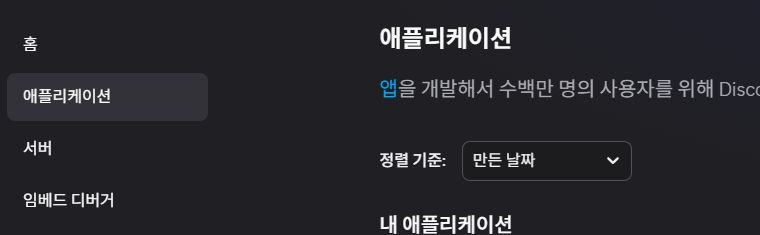

Discord Application은 프로그램 설치 파일이 아니라, Gacha Overlay가 Discord 인증을 요청할 때 사용하는 개인 연결 항목입니다.

> [!TROUBLESHOOT]
> Applications 화면이 보이지 않으면 로그인한 Discord 계정이 맞는지 확인한 뒤 Portal을 새로 고침하세요.

<!-- PAGE -->

# 새 Application 만들기

## 2. `New Application`을 누르세요

**Discord Developer Portal → Applications → New Application**

1. 오른쪽 위의 `신규 애플리케이션`을 누릅니다.
2. 알아보기 쉬운 이름을 입력합니다. 예: `Gacha Overlay Personal`
3. Discord 약관 확인 항목이 있다면 내용을 읽고 동의합니다.
4. `Create`를 눌러 Application을 만듭니다.

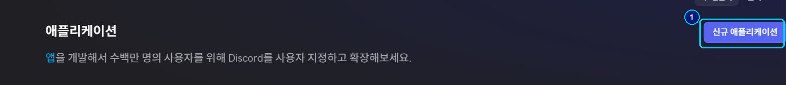

> [!RESULT]
> Application 설정 화면으로 이동하고 왼쪽 메뉴에 `OAuth2`가 보이면 정상입니다.

> [!TIP]
> 이 Application은 본인의 Controlled Test 연결에만 사용하세요. 기존 Production Application의 이름이나 설정을 임의로 바꾸지 마세요.

<!-- PAGE -->

# OAuth2 화면 찾기

## 3. OAuth2 메뉴를 여세요

**Discord Developer Portal → 내 Application → OAuth2**

1. 왼쪽 메뉴에서 `OAuth2`를 클릭합니다.
2. `클라이언트 정보` 영역을 찾습니다.

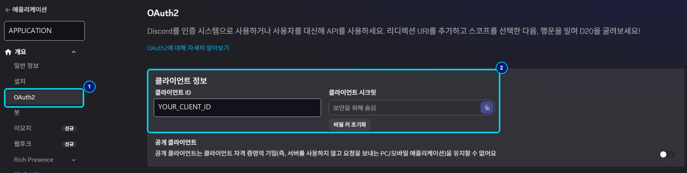

OAuth는 Gacha Overlay가 사용자의 Discord 계정과 안전하게 연결하기 위해 사용하는 인증 절차입니다. 복잡한 서버를 직접 운영할 필요는 없습니다.

> [!RESULT]
> Client ID와 Client Secret 위치, Redirects 영역을 확인할 수 있으면 정상입니다.

<!-- PAGE -->

# Client ID 확인하기

## 4. Client ID를 복사하세요

Client ID는 **어떤 Discord Application인지 식별하는 번호**라고 생각하면 됩니다. 비밀번호는 아니지만, 설명서나 공개 게시물에 불필요하게 노출하지 않는 편이 좋습니다.

1. `클라이언트 ID` 표시 영역에서 값을 복사합니다. Portal에 복사 아이콘이나 버튼이 보이면 그것을 사용합니다.
2. 메모장 대신 Gacha Overlay 입력 화면에 바로 붙여 넣을 준비를 합니다.

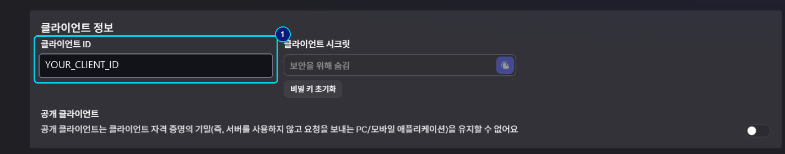

> [!IMPORTANT]
> 화면의 `YOUR_CLIENT_ID`는 마스킹 예시입니다. 실제로는 본인의 Application에 표시된 값을 사용합니다.

> [!RESULT]
> Gacha Overlay의 `Discord Application / Client ID` 입력란에 붙여 넣을 수 있으면 준비가 끝났습니다.

<!-- PAGE -->

# Client Secret 안전하게 확인하기

## 5. Client Secret을 확인하세요

Client Secret은 **Application의 비밀번호에 가까운 값**입니다. Gacha Overlay가 OAuth authorization code를 token으로 교환할 때 필요합니다.

1. `클라이언트 시크릿` 영역을 찾습니다.
2. 새 Application에서 값이 숨겨져 있고 복사할 수 없다면 `비밀 키 초기화` 또는 `Reset Secret`을 눌러 새 Secret을 발급합니다.
3. Portal이 계정 확인이나 2단계 인증을 요구하면 화면 안내를 완료합니다.
4. 새 Secret이 표시되는 즉시 복사해 Gacha Overlay 입력 화면에 붙여 넣습니다.

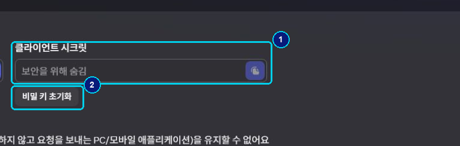

> [!SECURITY]
> Client Secret은 다른 사람에게 보내거나 Discord 채팅, GitHub, 스크린샷, 화면 공유에 올리지 마세요. Gacha Overlay는 저장할 때 Windows current-user DPAPI로 보호합니다.

> [!IMPORTANT]
> 현재 Portal처럼 Secret 값 대신 `보안을 위해 숨김`만 표시되는 경우에는 최초 값을 얻기 위해 Reset Secret이 필요합니다. 이미 사용 중인 Secret을 Reset하면 기존 값 대신 새 값으로 Gacha Overlay 설정도 다시 입력해야 합니다. 복사한 뒤에는 유출되거나 잃어버린 경우가 아니라면 반복해서 Reset하지 마세요.

<!-- PAGE -->

# Redirect URI 입력하기

## 6. 주소를 그대로 추가하세요

**Discord Developer Portal → OAuth2 → Redirects → Add Redirect**

1. OAuth2 화면의 `Redirects` 영역으로 이동합니다.
2. `Add Redirect`를 누릅니다.
3. 아래 주소를 오타 없이 붙여 넣습니다.
4. Portal에 저장 버튼이 표시되면 변경 사항을 저장합니다.

> [!COPY]
> Redirect URI
> https://127.0.0.1

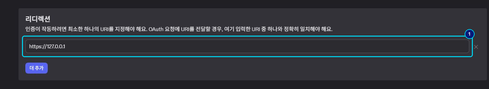

이 주소는 Discord OAuth 설정에서 요구되는 값입니다. Gacha Overlay가 로컬 HTTP callback listener를 여는 것은 아닙니다.

> [!TROUBLESHOOT]
> 인증이 시작되지 않으면 `http`가 아니라 `https`인지, 숫자와 점이 `127.0.0.1`과 정확히 일치하는지 확인하세요.

<!-- PAGE -->

# 필요한 OAuth 범위 확인하기

## 7. 세 가지 scope만 사용합니다

Scope는 Gacha Overlay가 Discord에 요청하는 권한 범위입니다. 다음 세 값이 필요합니다.

> [!COPY]
> Required scopes
> rpc
> identify
> messages.read

- `rpc`: Discord Desktop Local RPC 인증에 필요합니다.
- `identify`: 로그인한 Discord 사용자를 확인합니다.
- `messages.read`: 필요한 메시지 정보를 읽는 범위입니다.

> [!SECURITY]
> Discord User Token, Self-bot, 브라우저 저장 정보 또는 DevTools token은 사용하지 않습니다. 이를 요구하는 안내는 따르지 마세요.

> [!RESULT]
> Redirect URI와 세 scope를 확인했으면 Portal에서 필요한 OAuth 준비가 끝났습니다.

<!-- PAGE -->

# Discord 인증 문제 해결

## 인증 오류가 있을 때만 App Tester를 확인하세요

App Tester 등록은 모든 사용자가 거치는 일반 설치 단계가 아닙니다. 먼저 다음 페이지의 정상 OAuth 연결을 진행하세요. Discord 인증이 권한 오류로 계속 실패하고 Client ID, Client Secret, Redirect URI와 로그인 계정이 모두 맞는 경우에만 아래 항목을 확인합니다.

1. Discord Developer Portal에서 현재 Application의 `앱 테스터` 화면을 엽니다.
2. 인증에 사용할 Discord username이 이미 등록되어 있는지 확인합니다.
3. Application의 배포 상태상 필요한 경우에만 계정을 추가합니다.
4. 같은 Discord 계정으로 다시 인증합니다.

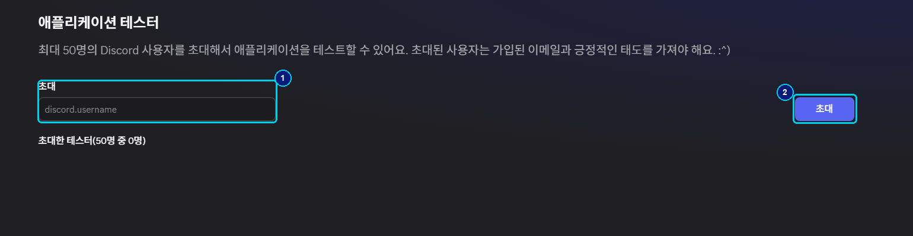

> [!IMPORTANT]
> Portal 정책과 Application 배포 상태에 따라 이 단계가 필요하지 않을 수 있습니다. Tester 등록을 정상 설치의 필수 조건으로 취급하지 마세요.

> [!TROUBLESHOOT]
> 권한 오류가 계속될 때만 로그인 계정과 조건부 Tester 등록 계정이 같은지 확인하세요.

<!-- PAGE -->

# OAuth 연결은 이렇게 진행됩니다

## 사용자가 알아야 할 핵심만 정리했어요

<!-- FLOW: Gacha Overlay가 Local RPC AUTHORIZE 요청|Discord Desktop이 로그인 확인|Discord가 authorization code 반환|앱이 token endpoint로 code 교환|DPAPI로 credential 보호|HUD 연결 시작 -->

Gacha Overlay는 Discord Desktop Local RPC의 `AUTHORIZE`로 authorization code를 받습니다. 이어서 `https://discord.com/api/v10/oauth2/token`에 Client ID와 Client Secret을 사용하는 Basic authentication으로 token 교환을 요청합니다.

> [!TIP]
> 사용자가 직접 준비하는 것은 개인용 Discord Application, Client ID, Client Secret입니다. OAuth access/refresh token은 사용자가 만들거나 복사하지 않으며 Gacha Overlay가 인증 과정에서 자동으로 발급받습니다.

> [!IMPORTANT]
> 브라우저에서 localhost 페이지가 열리기를 기다릴 필요가 없습니다. Gacha Overlay는 로컬 HTTP callback listener를 사용하지 않습니다.

> [!SECURITY]
> Secret과 token은 현재 Windows 사용자 범위의 DPAPI로 보호됩니다. 다른 Windows 사용자 계정으로 복사한 credential은 그대로 사용할 수 없습니다.

> [!RESULT]
> 이제 Portal을 닫지 않아도 되지만, Gacha Overlay 초기 설정 창으로 돌아가 다음 단계를 진행할 수 있습니다.

<!-- PAGE -->

# PART 3 · Gacha Overlay 처음 연결하기

## 1단계 · 언어 선택

1. Gacha Overlay 초기 설정 창으로 돌아갑니다.
2. 언어 목록에서 사용할 언어를 선택합니다.
3. `다음`을 누릅니다.

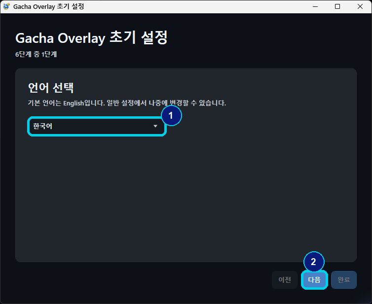

지원 언어는 `English`, `한국어`, `日本語`입니다. 첫 실행 기본값은 English이며, 설정을 끝낸 뒤에도 **설정 → 일반 → 언어**에서 바꿀 수 있습니다.

> [!RESULT]
> 화면 위쪽에 `6단계 중 1단계`가 보이고 다음 단계로 이동하면 정상입니다.

<!-- PAGE -->

# Discord 인증 정보 입력하기

## 2단계 · Client ID와 Secret

1. 복사해 둔 Client ID를 첫 번째 입력란에 붙여 넣습니다.
2. Client Secret을 두 번째 입력란에 붙여 넣습니다.
3. Redirect URI가 아래 값과 같은지 확인합니다.
4. `다음`을 누릅니다.

> [!COPY]
> OAuth Redirect URI
> https://127.0.0.1

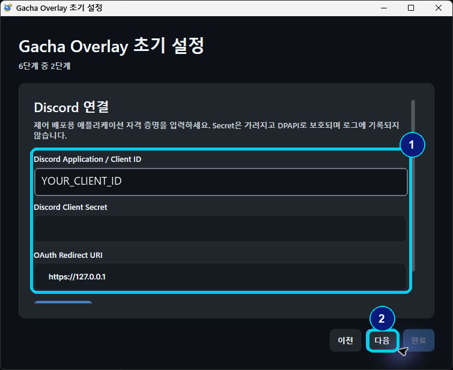

> [!SECURITY]
> Client Secret은 이 입력 화면 외의 채팅, 문서, 진단 ZIP 또는 스크린샷에 넣지 마세요.

> [!TROUBLESHOOT]
> 입력 직후 오류가 나면 앞뒤 공백이 붙지 않았는지, 다른 Application의 ID와 Secret을 섞지 않았는지 확인하세요.

<!-- PAGE -->

# Discord 연결 완료 확인하기

## 인증 창이 나타나면 허용하세요

Discord Desktop이 연결 허용 화면을 표시하면 Application 이름과 요청 범위를 확인한 뒤 승인합니다. Gacha Overlay로 돌아오면 연결 상태가 갱신됩니다.

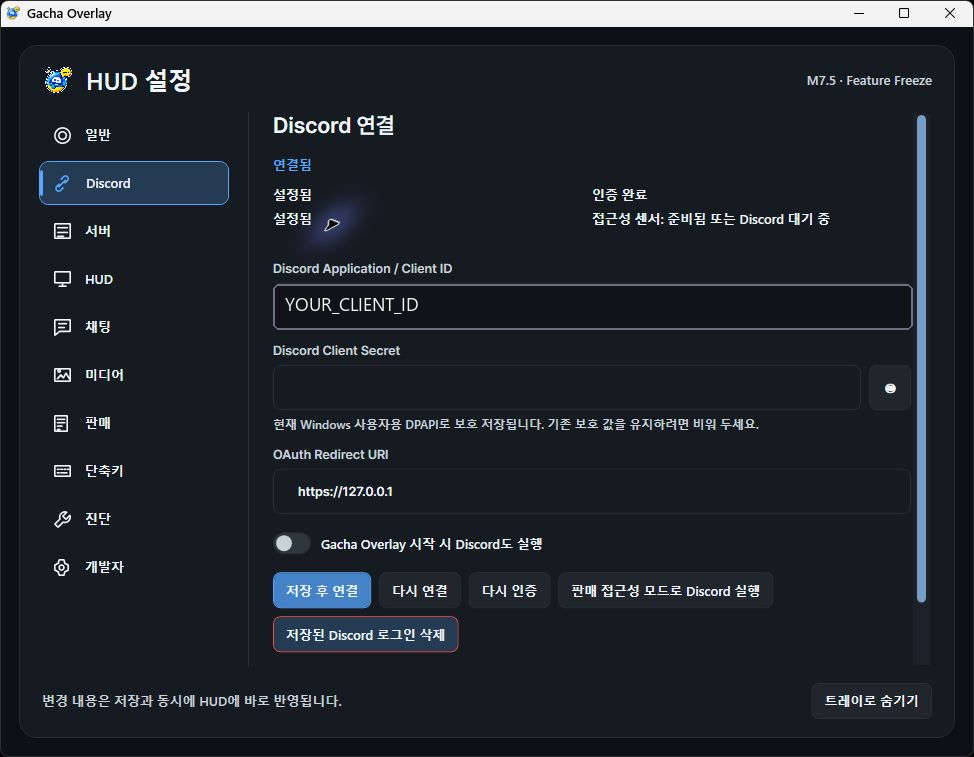

> [!RESULT]
> 정상이라면 다음 항목을 확인할 수 있습니다. 연결 상태가 정상으로 표시됩니다. Client ID가 저장됩니다. 인증 관리 버튼이 활성화됩니다. 다음 서버 확인 단계로 이동할 수 있습니다.

> [!TROUBLESHOOT]
> Discord 인증 창이 나오지 않으면 Discord Desktop이 실행 중이고 같은 계정으로 로그인되어 있는지 확인한 뒤 `다시 연결`을 시도하세요.

<!-- PAGE -->

# 대상 서버 확인하기

## 3단계 · Production Server

Server는 Gacha Overlay가 연결할 Discord 서버입니다. 이 RC에서는 Production Guild가 고정되어 있습니다.

1. 표시된 서버 이름이 사용하려는 대상과 맞는지 확인합니다.
2. 서버 접근 상태가 정상인지 확인합니다.
3. `다음`을 누릅니다.

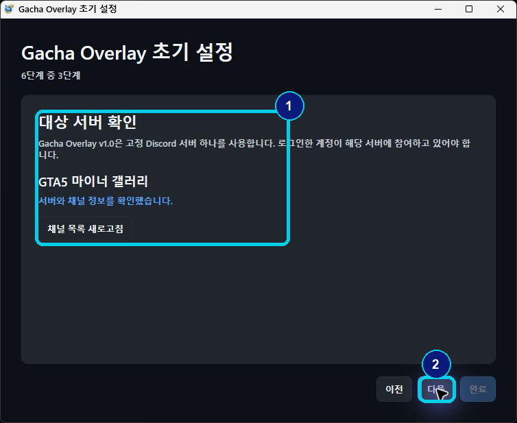

> [!RESULT]
> 서버 확인 문구가 정상으로 표시되고 Main Channel 선택 단계로 이동하면 정상입니다.

> [!TROUBLESHOOT]
> 서버가 보이지 않으면 Discord 계정과 서버 참여 상태를 먼저 확인하세요. 인증 권한 오류가 함께 발생할 때만 앞의 `Discord 인증 문제 해결`에서 App Tester 조건을 확인합니다.

<!-- PAGE -->

# Main Channel 선택하기

## 4단계 · HUD에 표시할 채널

Main Channel은 HUD에 일반 채팅을 표시할 채널입니다. Production Guild와 Sales Channel은 고정이지만 Main Channel은 한 개를 선택할 수 있습니다.

1. 드롭다운을 엽니다.
2. HUD에서 보고 싶은 Main Channel을 선택합니다.
3. 확인 문구를 읽습니다.
4. `다음`을 누릅니다.

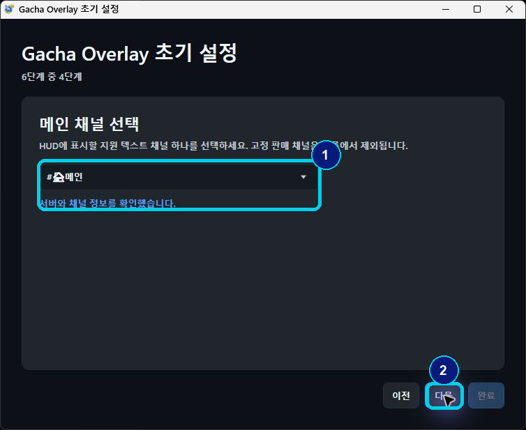

<!-- CHANNEL_MAP -->

> [!RESULT]
> 선택한 채널 이름이 표시되고 판매 호환 모드 단계로 이동하면 정상입니다.

<!-- PAGE -->

# 판매 호환 모드 설정하기

## 5단계 · Sales Accessibility

판매 대기열은 판매 완료 reaction 상태까지 확인해야 합니다. Discord Local RPC만으로 부족한 정보는 Discord Accessibility 정보를 함께 사용합니다.

1. 판매 기능을 사용할지 선택합니다.
2. Discord 접근성 상태 안내를 확인합니다.
3. 안내된 Discord 설정이 준비되어 있는지 확인합니다.
4. `다음`을 누릅니다.

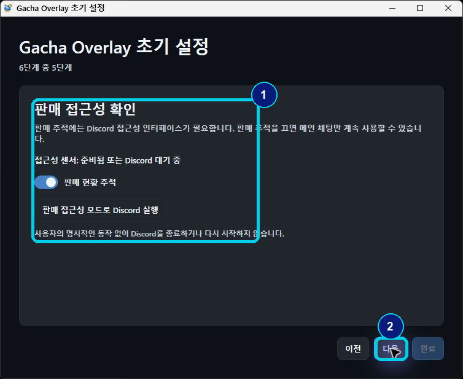

> [!IMPORTANT]
> 판매 기능을 사용하지 않아도 Main Chat HUD는 사용할 수 있습니다. 판매 상태가 `Paused`여도 전체 프로그램 고장으로 단정하지 마세요.

> [!TROUBLESHOOT]
> 판매 접근성 확인 중 오류가 나면 Discord Desktop이 판매 채널을 표시할 수 있는 상태인지 확인하고 재시도하세요.

<!-- PAGE -->

# HUD 준비 완료

## 6단계 · 단축키를 기억하세요

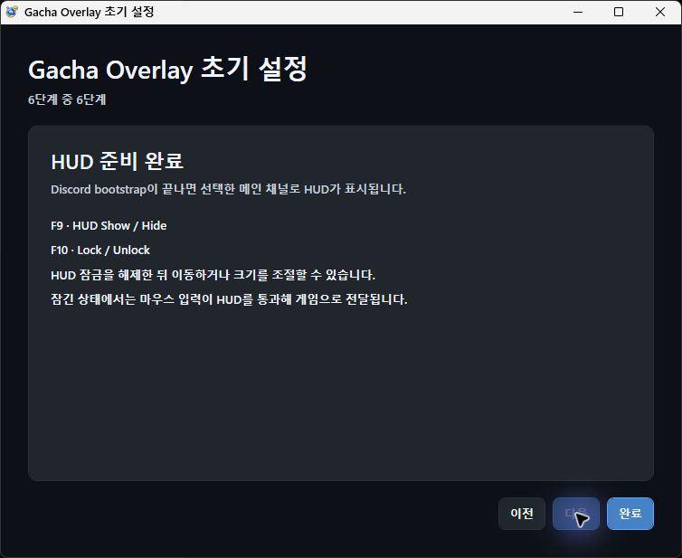

## 가장 중요한 두 키

<!-- HOTKEYS -->

1. 안내 내용을 확인합니다.
2. `완료`를 눌러 초기 설정을 끝냅니다.
3. HUD가 화면에 나타나는지 확인합니다.

> [!RESULT]
> 채팅 영역, 판매 상태 영역, Gear 버튼이 있는 HUD Shell이 나타나면 처음 연결이 완료된 것입니다.

<!-- PAGE -->

# PART 4 · HUD를 실제 게임에서 사용하기

## HUD 화면 읽기

- 위쪽 큰 영역: 선택한 Main Channel의 채팅
- 아래쪽 상태 막대: 판매 기능 상태와 Queue Detail
- 오른쪽 위 Gear: 설정 열기
- 상태 색과 문구: Discord 연결 및 판매 추적 상태

> [!TIP]
> 개인정보 보호를 위해 이 설명서의 채팅과 닉네임은 불투명 마스킹되어 있습니다. 실제 앱에서는 본인이 접근할 수 있는 채널 내용이 표시됩니다.

> [!RESULT]
> 새 메시지가 들어오고 판매 기능을 켰다면 현재/다음 판매 순서가 갱신됩니다.

<!-- PAGE -->

# Locked와 Unlocked 이해하기

## F10은 HUD 편집 가능 여부를 바꿉니다

<!-- LOCK_COMPARE -->

## 잠근 상태에서 Queue Detail은 어떻게 되나요?

Queue Detail이 펼쳐진 상태에서 F10으로 잠가도 목록은 계속 보입니다. 다만 HUD 전체가 click-through가 되므로 Scroll, Chevron, Button 입력을 받지 않습니다. 다시 F10으로 잠금을 풀면 펼쳐진 상태 그대로 조작이 복원됩니다.

> [!IMPORTANT]
> 잠금은 Queue Detail을 접지 않습니다. Sales Tracking OFF, Queue Empty, UltraCompact, 앱을 새로 시작한 경우에는 기존 정책에 따라 자동으로 접힐 수 있습니다.

> [!RESULT]
> 게임 조작 중에는 클릭이 HUD를 통과하고, 편집할 때만 HUD가 마우스 입력을 받으면 정상입니다.

<!-- PAGE -->

# HUD 이동과 크기 조절

## 먼저 F10으로 잠금을 푸세요

1. F10을 눌러 HUD를 Unlocked 상태로 만듭니다.
2. HUD의 빈 영역을 드래그해 위치를 옮깁니다.
3. 가장자리나 모서리를 드래그해 크기를 조절합니다.
4. Gear를 눌러 설정을 엽니다.
5. 작업이 끝나면 F10으로 다시 잠급니다.

> [!TIP]
> GTA5에 마우스 포커스가 남아 있다면 잠금을 푼 직후 바로 드래그되지 않을 수 있습니다. HUD Shell을 한 번 클릭해 포커스를 옮긴 뒤 이동이나 크기 조절을 시작하세요.

## F9로 표시만 빠르게 바꾸기

F9는 저장된 설정을 지우지 않고 HUD를 보이거나 숨깁니다. HUD가 사라졌다고 설정을 처음부터 다시 할 필요는 없습니다.

> [!TROUBLESHOOT]
> HUD가 움직이지 않으면 F10 상태와 HUD 포커스를 확인하세요. 클릭이 게임으로 계속 통과하면 아직 Locked 상태입니다.

<!-- PAGE -->

# PART 5 · 내 취향에 맞게 설정하기

## 일반 설정과 테마

**HUD Unlocked → Gear → 일반**

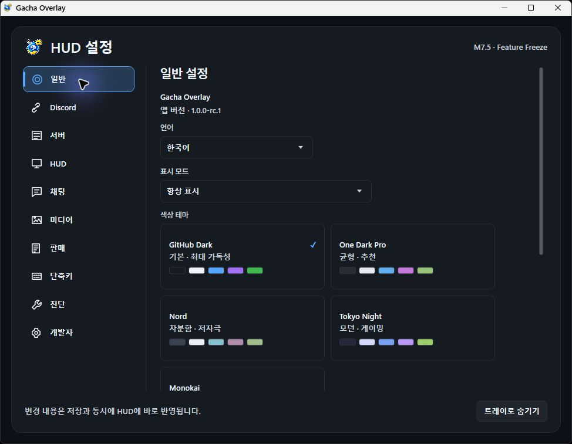

자주 사용하는 항목은 언어, 표시 모드, 색상 테마입니다. 테마는 현재 UI에 표시된 다섯 가지 중에서 선택할 수 있습니다.

- GitHub Dark
- One Dark Pro
- Nord
- Tokyo Night
- Monokai

> [!TIP]
> 설정은 변경 즉시 또는 화면 안내에 따라 반영됩니다. 한 번에 여러 항목을 바꾸기보다 하나씩 바꾸고 HUD를 확인하세요.

<!-- PAGE -->

# Main Channel을 나중에 바꾸기

## 서버 설정에서 다시 선택할 수 있어요

**Settings → Server → Main Channel**

1. HUD 잠금을 풉니다.
2. Gear를 눌러 Settings를 엽니다.
3. `서버`를 선택합니다.
4. Main Channel 드롭다운에서 새 채널을 선택합니다.

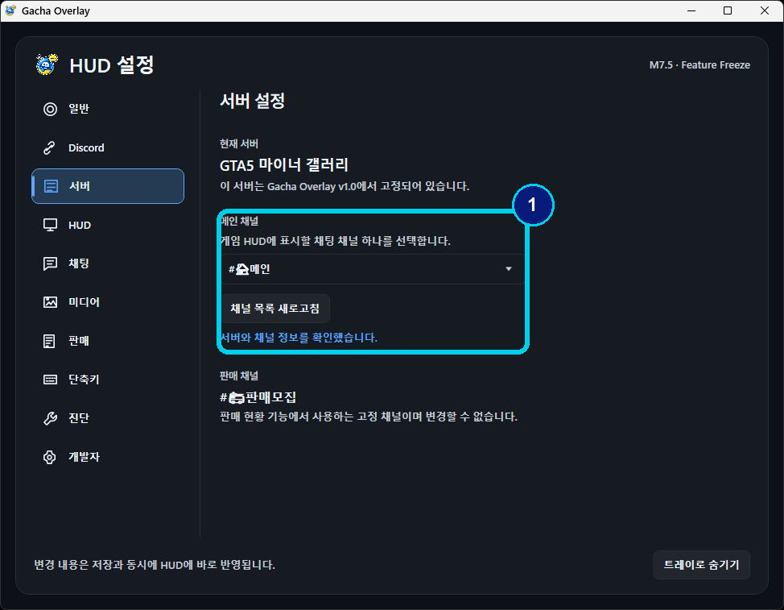

> [!IMPORTANT]
> Production Guild와 Sales Channel은 별도로 선택하지 않습니다. 이 두 대상은 Controlled Test 정책에 따라 고정되어 있습니다.

> [!RESULT]
> 선택한 Main Channel의 새 메시지가 HUD에 표시되면 정상입니다.

<!-- PAGE -->

# 채팅 글꼴과 읽기 편한 표시

## 타이포그래피와 외곽선을 조절하세요

**Settings → 채팅**

글꼴 스타일은 현재 화면에 표시된 네 가지 중에서 선택합니다.

- Clean
- Modern
- High Readability
- GTA Legacy

텍스트 크기와 외곽선 굵기는 게임 배경에서도 글자가 읽히는 수준으로 조절하세요. 고해상도 모니터에서는 한 단계씩 올려 확인하는 방법이 안전합니다.

> [!TIP]
> 닉네임이 길거나 Emoji가 포함된 메시지도 다음 채팅과 겹치지 않도록 현재 레이아웃이 보정되어 있습니다. 문제가 보이면 화면과 함께 진단 ZIP을 준비하세요.

<!-- PAGE -->

# HUD 모양 조절하기

## 투명도와 배경을 내 화면에 맞추세요

**Settings → HUD**

HUD 설정에서는 배경, 채팅 영역, 판매 영역 등 화면 요소의 투명도를 조절할 수 있습니다. 게임 배경과 겹쳤을 때 읽기 어려우면 배경 불투명도를 먼저 높여보세요.

1. 한 개의 slider만 조금 움직입니다.
2. 실제 HUD를 확인합니다.
3. 읽기 쉽다면 다음 항목을 조절합니다.

> [!IMPORTANT]
> 너무 투명하게 설정하면 정상 동작 중이어도 HUD가 보이지 않는 것처럼 느낄 수 있습니다.

<!-- PAGE -->

# 이미지와 미디어 표시

## 미리보기 크기를 조절하세요

**Settings → 미디어**

이미지 미리보기, 가로 이미지 표시, Sticker 표시와 미디어 크기를 조절할 수 있습니다. Unlocked 상태에서는 지원되는 미디어를 클릭해 확대할 수 있습니다.

> [!IMPORTANT]
> 모든 Discord 미디어 형식이 항상 원본 이미지로 전달되는 것은 아닙니다. metadata가 부족하면 Sticker는 `[스티커]`, 전달된 메시지는 `[메시지]`처럼 안전한 대체 문구로 표시될 수 있습니다.

> [!TROUBLESHOOT]
> 이미지가 너무 크거나 다음 메시지와 겹치면 Media Size를 낮추고 HUD 높이를 확인하세요.

<!-- PAGE -->

# 단축키 빠르게 확인하기

<!-- HOTKEYS -->

## 키가 동작하지 않는다면

- 다른 프로그램이 같은 키를 사용하고 있는지 확인합니다.
- HUD가 숨겨졌다면 F9를 한 번 눌러봅니다.
- 이동/크기 조절이 안 되면 F10으로 Unlocked 상태인지 확인합니다.
- 게임이 포커스를 가진 상태라면 HUD Shell을 한 번 클릭합니다.

> [!RESULT]
> F9는 표시만 바꾸고, F10은 입력 통과와 편집 가능 여부를 바꿉니다.

<!-- PAGE -->

# PART 6 · 판매 대기열 사용하기

## 판매 추적 설정 확인

**Settings → 판매**

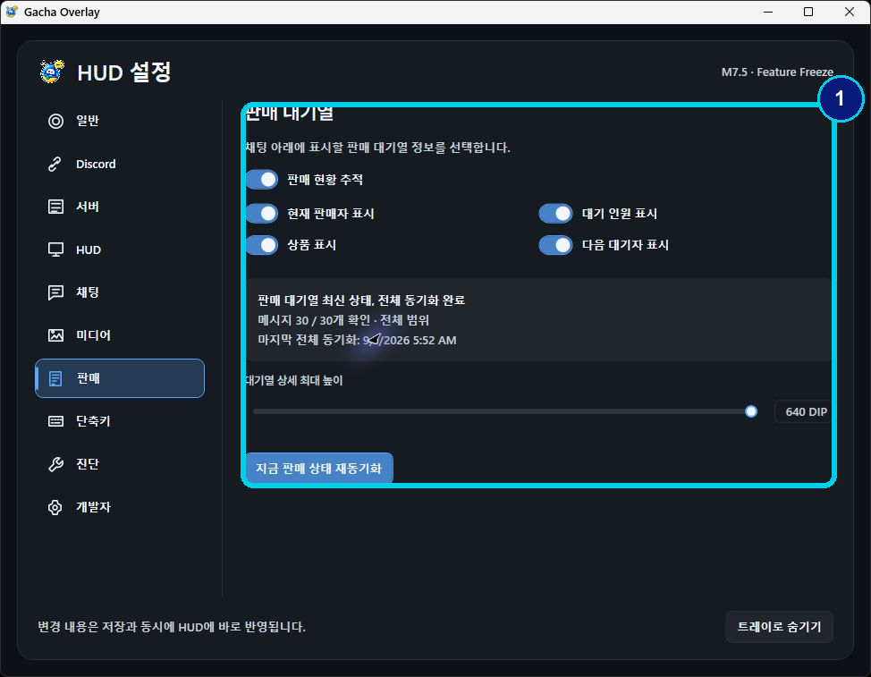

판매 추적, 현재 판매자, 상품 요약, 대기 인원과 Queue Detail 표시를 필요에 맞게 켤 수 있습니다. 상태가 이상하면 `지금 판매 상태 재동기화`를 사용합니다.

> [!IMPORTANT]
> Sales Tracking을 끄면 Queue Detail은 접힙니다. 다시 켠 뒤 Discord 판매 채널 상태가 준비되어야 대기열이 갱신됩니다.

> [!TROUBLESHOOT]
> `Paused`가 보이면 Discord가 판매 채널 화면을 현재 제공하지 않는 상태일 수 있습니다. Main Chat은 계속 정상 동작할 수 있습니다.

<!-- PAGE -->

# 판매 대기열 읽기

## 현재와 다음 순서를 확인하세요

- `현재`: 지금 판매할 사용자
- 번호 목록: 대기 순서
- 상품 문구: 판매글에서 해석된 상품 요약
- Chevron: Queue Detail 펼치기/접기

Queue Detail은 HUD 잠금 상태와 펼침 상태를 따로 기억합니다. 잠가도 목록은 보이지만 마우스 입력은 게임으로 통과합니다. 다시 잠금을 풀면 Scroll과 Collapse 조작이 즉시 복원됩니다.

> [!RESULT]
> 판매글이 올라오면 순서와 상품이 표시되고, 완료 reaction이 확인되면 Active Queue에서 빠지는 것이 정상입니다.

<!-- PAGE -->

# 판매가 처리되는 순서

## 게시부터 완료까지

<!-- FLOW: 판매글 작성|HUD Queue에 반영|현재·다음 순서 표시|SOLD 또는 :closed: 확인|Active Queue에서 제거|필요 시 원래 순서로 복귀 -->

판매 완료 reaction은 `SOLD` 또는 `:closed:` 중 하나가 존재하면 완료로 판단합니다. 두 reaction이 모두 제거된 상태가 정상 확인되면 원래 Queue 순서로 복귀할 수 있습니다.

> [!IMPORTANT]
> Discord에서 reaction 상태가 아직 동기화되지 않았다면 HUD 반영도 늦을 수 있습니다. 잠시 기다린 뒤 판매 상태 재동기화를 시도하세요.

> [!RESULT]
> Queue order와 상품 내용은 HUD Lock/Unlock만으로 바뀌지 않습니다.

<!-- PAGE -->

# 상품 문구 이해하기

## 짧고 일관된 형식으로 표시됩니다

<!-- PRODUCT_EXAMPLES -->

- `벙커`: 상품 한 개
- `벙커 x2`: 같은 상품 두 개
- `벙커 x2 · 나클`: 수량과 다른 상품을 함께 표시

일반 사용자는 Product Mapping Manager를 수정할 필요가 없습니다. 이 기능은 예외적인 상품 표기 override가 필요한 고급 운영 용도입니다.

## 완료가 반영되지 않을 때

1. Discord의 고정 Sales Channel을 엽니다.
2. 완료 reaction이 실제로 존재하는지 확인합니다.
3. Accessibility 상태를 확인합니다.
4. **Settings → 판매 → 지금 판매 상태 재동기화**를 사용합니다.

> [!RESULT]
> 완료된 항목이 Active Queue에서 제거되면 정상입니다.

<!-- PAGE -->

# PART 7 · 문제가 생겼을 때

## 먼저 상태를 확인하세요

**Settings → 진단 및 복구**

이 화면에서는 로그 폴더, 최신 로그, 진단 파일, 미디어 캐시, HUD 위치와 크기 등 자주 필요한 복구 작업을 찾을 수 있습니다.

1. 화면 위쪽의 연결 상태를 읽습니다.
2. 문제가 발생한 기능을 다시 한 번 재현합니다.
3. 앱을 종료하지 않은 채 진단 파일을 만들 준비를 합니다.

> [!TIP]
> 단순 표시 문제라면 HUD 위치/크기 초기화 또는 모든 설정 초기화 전에 현재 설정과 증상을 먼저 기록하세요.

<!-- PAGE -->

# Diagnostic ZIP 만들기

## 지원 요청에 필요한 파일을 저장하세요

**Settings → 진단 및 복구 → 진단 파일 만들기**

1. `진단 파일 만들기`를 누릅니다.
2. 저장 위치를 선택합니다.
3. 생성 완료 안내를 확인합니다.
4. ZIP 내용을 확인한 뒤 지원하는 사람에게 직접 전달합니다.

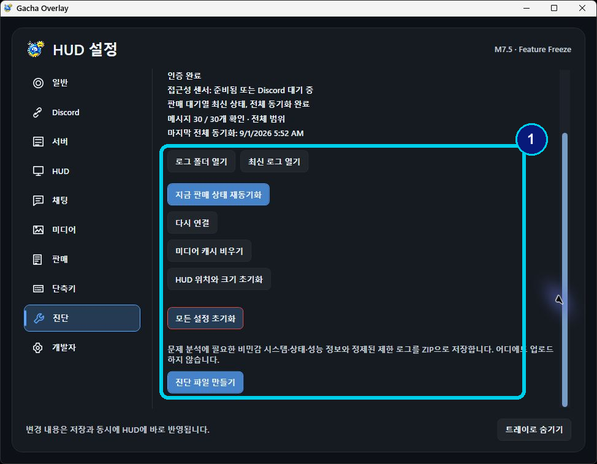

> [!SECURITY]
> Diagnostic ZIP은 자동 업로드되지 않습니다. Client Secret, OAuth token, credential file, Discord message body는 포함하지 않도록 설계되어 있습니다. 그래도 전달 전 내용을 직접 확인하세요.

> [!RESULT]
> 선택한 위치에 ZIP이 생성되고 앱/HUD/Discord 연결이 계속 정상이라면 완료입니다.

<!-- PAGE -->

# Discord 또는 HUD가 이상할 때

## HUD가 보이지 않아요

**증상**: 앱은 실행 중인데 HUD가 없습니다.  
**가능한 원인**: F9 숨김, 화면 밖 위치, 매우 낮은 투명도.  
**해결 순서**: Windows 오른쪽 아래 알림 영역 → 필요하면 `숨겨진 아이콘 표시(^)` → Gacha Overlay 아이콘 우클릭 → `HUD 표시` → 진단 및 복구 → HUD 위치와 크기 초기화 → HUD 투명도 확인.  
**정상 결과**: HUD Shell과 상태 막대가 화면에 나타납니다.

> [!TIP]
> 트레이 아이콘의 우클릭 메뉴에서는 `HUD 표시/숨기기`, `HUD 잠금/잠금 해제`, `설정`, `Discord 연결 설정`, `Discord 다시 연결`, `종료`를 사용할 수 있습니다. 아이콘을 더블클릭해도 HUD 표시 상태가 전환됩니다.

## HUD를 움직일 수 없어요

**증상**: 드래그해도 게임만 클릭됩니다.  
**가능한 원인**: Locked 상태 또는 게임에 남은 마우스 포커스.  
**해결 순서**: F10 → HUD Shell 한 번 클릭 → 빈 영역 드래그.  
**정상 결과**: HUD가 이동하고 크기 조절이 됩니다.

## Discord 연결이 안 돼요

**증상**: 인증 창이 없거나 연결 상태가 실패입니다.  
**가능한 원인**: Discord Desktop 미실행, 다른 계정, ID/Secret 불일치 또는 Application 상태에 따른 권한 제한.

**해결 순서**: Discord 계정 확인 → ID/Secret 확인 → 다시 연결 → 권한 오류가 계속될 때만 App Tester 조건 확인.
**정상 결과**: `LiveAndBootstrapped` 또는 정상 연결 상태가 표시됩니다.

<!-- PAGE -->

# 판매·Sticker·전달 메시지 문제

## 판매 대기열이 `Paused`예요

**가능한 원인**: Discord가 고정 Sales Channel 화면을 제공하지 않는 상태입니다.  
**해결 순서**: Discord에서 Sales Channel 열기 → Accessibility 확인 → 판매 상태 재동기화.  
**정상 결과**: 판매 상태가 재개되고 Queue가 갱신됩니다.

## SOLD를 눌렀는데 반영되지 않아요

**가능한 원인**: reaction 동기화 지연 또는 Accessibility 상태 중단입니다.  
**해결 순서**: reaction 확인 → 잠시 대기 → 판매 상태 재동기화.  
**정상 결과**: 항목이 Active Queue에서 제거됩니다.

## Sticker가 `[스티커]`로 보여요

Sticker metadata가 충분하지 않으면 이미지 대신 안전한 대체 문구를 표시할 수 있습니다. 이것은 다른 종류의 메시지를 Sticker로 추측하는 것보다 안전한 fallback입니다.

## 전달 메시지가 `[메시지]`로 보여요

Forward metadata가 불완전하면 원문 종류를 단정하지 않고 `[메시지]`로 표시할 수 있습니다. Main Chat 동작 자체가 중단된 것은 아닙니다.

<!-- PAGE -->

# PART 8 · 보안 · 데이터 · 제한사항

## Credential 보호

- Client Secret과 OAuth token은 Windows current-user DPAPI로 보호합니다.
- 다른 Windows 사용자 계정이나 다른 PC로 credential을 그대로 복사해 사용할 수 없습니다.
- User Token, Self-bot, 브라우저 DevTools token은 사용하지 않습니다.
- Client Secret을 reset하면 기존 값은 더 이상 사용할 수 없습니다.

## 로컬 중심 통신 구조

인증 이후 실시간 Discord 이벤트의 주 경로는 PC 내부의 Discord Desktop Local RPC/IPC Named Pipe입니다. 별도 공개 웹 서버나 로컬 HTTP callback listener를 운영하지 않아 외부에 노출되는 지점이 적습니다. 다만 최초 OAuth token 교환, 필요한 token refresh, 미디어 다운로드에는 Discord 네트워크 통신이 사용될 수 있으므로 credential 보호와 공식 Release 출처 확인은 계속 필요합니다.

## 로컬 데이터

설정, DPAPI 보호 credential, Product override, 로그, 캐시와 진단 관련 데이터는 `%LOCALAPPDATA%\GachaOverlay` 아래에 저장됩니다. EXE를 다른 폴더로 옮겨도 이 데이터는 별도로 유지됩니다.

## Diagnostic ZIP

진단 파일은 자동 업로드되지 않습니다. 사용자가 저장 위치와 전달 여부를 결정합니다. 전달 전에는 파일 내용을 확인하세요.

> [!SECURITY]
> Gacha Overlay 설정을 돕는다는 이유로 User Token, Secret, DevTools 저장 정보 또는 브라우저 credential을 요구하는 사람에게 값을 전달하지 마세요.

<!-- PAGE -->

# 알려진 제한사항과 수동 업데이트

## 현재 RC 범위

- Controlled small-group OAuth Release
- Production Guild 고정
- Sales Channel 고정
- Main Channel 한 개 선택
- Discord Desktop Local RPC 필요
- Sales Tracking은 Discord Accessibility 상태에 의존
- Public OAuth distribution은 이후 단계로 연기
- 일부 Sticker/Forward는 `[스티커]` 또는 `[메시지]` fallback 사용
- 자동 updater 없음
- Code signing 미구성으로 Windows publisher 경고 가능

## 수동 업데이트

1. 새 Release ZIP을 별도 폴더에 풉니다.
2. 기존 앱을 종료합니다.
3. 새 폴더의 `Gacha Overlay.exe`를 실행합니다.
4. 버전과 HUD 연결 상태를 확인합니다.

설정과 credential은 `%LOCALAPPDATA%\GachaOverlay`에 유지되므로 일반적으로 다시 입력할 필요가 없습니다.

## Third-party Notices

Release package의 `Licenses` 폴더에서 글꼴과 오픈소스 구성요소의 고지 및 라이선스를 확인할 수 있습니다.

<!-- PAGE -->

# QUICK REFERENCE

## 한 페이지로 다시 보기

<!-- QUICK_REFERENCE -->

## 지원 요청 전에

1. 앱 버전 `1.0.0-rc.1`을 확인합니다.
2. 문제가 발생한 작업 순서를 적습니다.
3. 가능하면 증상 화면을 준비합니다.
4. **Settings → 진단 및 복구 → 진단 파일 만들기**를 실행합니다.
5. ZIP 내용을 확인한 뒤 직접 전달합니다.

> [!SECURITY]
> Client Secret, OAuth token, User Token 또는 개인 Discord 메시지는 지원 요청에 포함하지 마세요.

이 문서는 Gacha Overlay 1.0.0-rc.1 Controlled Test Release용입니다.
